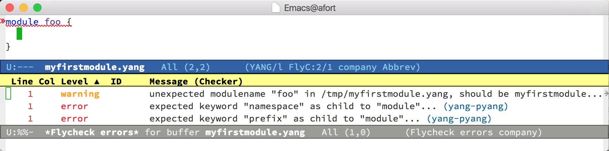

# yang-flycheck

A [Flycheck](http://www.flycheck.org/) syntax checker for
[YANG](https://tools.ietf.org/html/rfc6020) modules using
[pyang](https://github.com/mbj4668/pyang).

# Installation and usage

To assist editing YANG modules in emacs, first install [`yang-mode`](https://www.emacswiki.org/emacs/yang-mode.el).

Next, install [`pyang`](https://github.com/mbj4668/pyang).

Then install this package (e.g., via melpa `flycheck-yang`).

Finally, enable `flycheck-mode` (e.g., `M-x` `flycheck-mode` or using
a `yang-mode` hook).

# Screenshot

An example displaying the `*flycheck errors*` buffer available using
`M-x` `flycheck-list-errors`:

